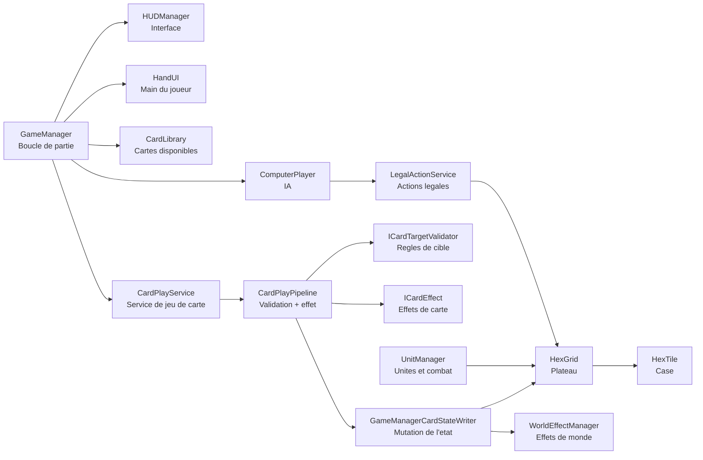
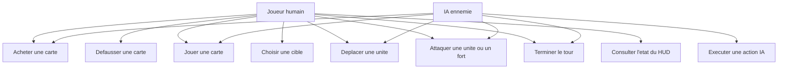
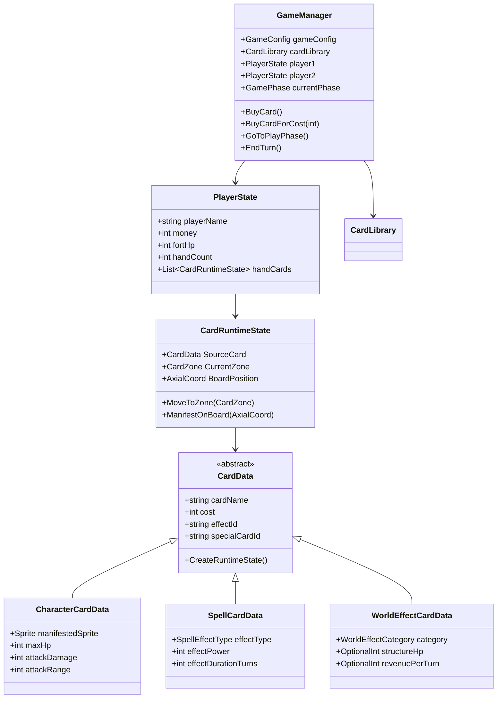
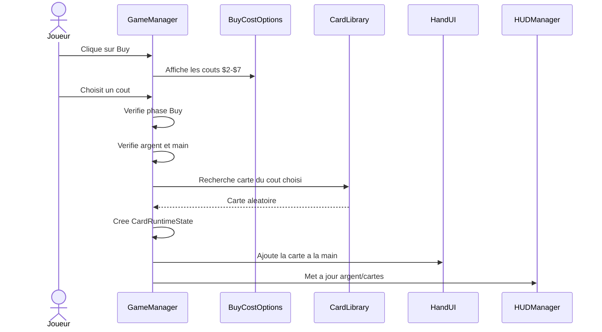
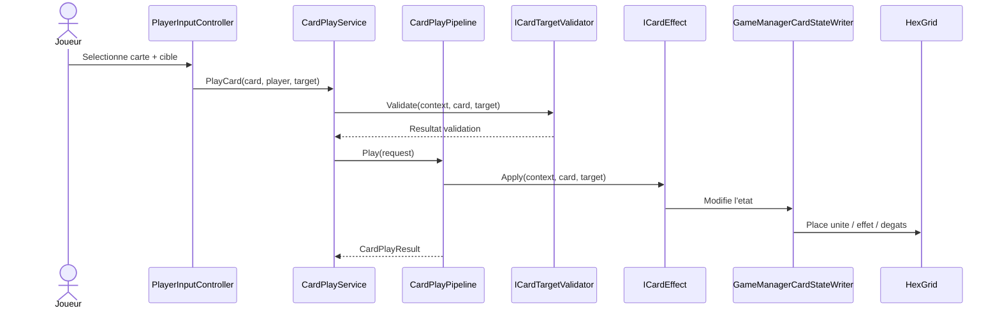
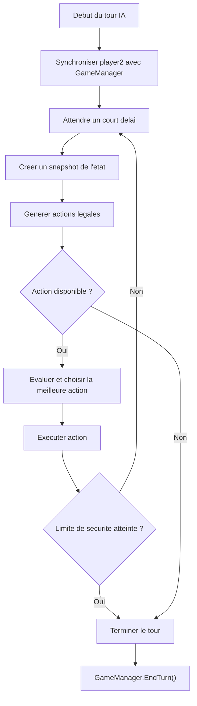

# Rapport du Projet Gaming - Partie 1/2

**Projet :** jeu de cartes tactique sur plateau hexagonal  
**Moteur :** Unity  
**Version du rapport :** premiere moitie du rapport complet  
**Date :** 09 juin 2026  

---

## 1. Introduction

Ce rapport presente l'etat actuel du projet de jeu, ses fonctionnalites principales, son architecture technique et les premiers diagrammes UML necessaires a la documentation finale. Le projet est un jeu tactique tour par tour combinant un systeme de cartes, une grille hexagonale, des unites, des effets de terrain, des sorts, une interface utilisateur et un adversaire controle par l'ordinateur.

L'objectif de cette premiere partie est de documenter les fondations du jeu : boucle de partie, gestion des joueurs, systeme d'achat, main de cartes, plateau, pipeline de jeu des cartes et premiers elements d'intelligence artificielle. La deuxieme partie du rapport devra completer cette base avec le detail carte par carte, les tests, les limites connues, les choix artistiques, les corrections restantes et le bilan de production.

---

## 2. Presentation generale du jeu

Le jeu oppose deux camps : le joueur humain et un ennemi controle par l'IA. Chaque joueur possede un fort, une main de cartes, de l'argent et des cartes pouvant etre achetees, jouees, deplacees ou utilisees selon leur type. Le but principal est de reduire les points de vie du fort adverse a zero.

Le gameplay repose sur plusieurs piliers :

- une grille hexagonale representant le champ de bataille ;
- des cartes de personnages qui deviennent des unites sur le plateau ;
- des cartes de sorts qui appliquent des effets immediats ou temporaires ;
- des cartes d'effets de monde qui modifient des cases du plateau ;
- une gestion de ressources permettant d'acheter de nouvelles cartes ;
- une boucle de tour en deux temps principaux : phase d'achat puis phase de jeu ;
- une IA capable d'acheter, de jouer des cartes, de deplacer des unites et d'attaquer.

Le projet vise un rendu lisible en 16:9 avec une resolution de reference 1920x1080. L'interface comprend des panneaux de joueur, un panneau ennemi, un panneau de tour, une zone de main, des boutons d'action contextuels et des messages d'annonce.

---

## 3. Fonctionnalites deja presentes

### 3.1 Gestion de partie

Le script central `GameManager` gere la creation de la partie, l'etat courant, les joueurs, les phases, les achats, les defausses, les tours et la detection de fin de partie. Il reference notamment :

- `GameConfig` pour les parametres globaux ;
- `CardLibrary` pour la liste des cartes disponibles ;
- `HUDManager` pour l'affichage ;
- `ComputerPlayer` pour le comportement de l'adversaire ;
- `HandUI` pour l'affichage de la main.

La partie commence par une initialisation des joueurs, de leur argent, de leurs points de vie de fort, de leur main et de la phase courante. Les tours alternent ensuite entre joueur humain et IA.

### 3.2 Phases de jeu

Le jeu utilise une enumeration `GamePhase` pour representer l'etat courant. Les phases principales sont :

- `Buy` : le joueur peut acheter une carte, defausser une carte ou passer directement en phase de jeu ;
- `Play` : le joueur peut jouer des cartes, bouger ses unites, attaquer puis terminer son tour ;
- `GameOver` : la partie est terminee et l'interface de fin s'affiche.

Le comportement des boutons depend de la phase. Par exemple, les boutons d'achat sont visibles en phase `Buy`, tandis que le bouton `End Turn` est surtout utile en phase `Play`.

### 3.3 Achat de cartes

Le systeme d'achat permet de choisir un cout d'achat entre 2 et 7. Le bouton `Buy` ouvre un menu de couts affichant les montants disponibles : `$2`, `$3`, `$4`, `$5`, `$6`, `$7`. Une fois le cout choisi, le jeu tente de creer une carte aleatoire correspondant a ce cout dans la bibliotheque.

Si la main du joueur est pleine, le jeu ne doit pas ajouter la carte immediatement. Il entre dans un etat de decision : le joueur doit confirmer l'achat puis defausser une carte. Cette regle evite de depasser la taille maximale de main.

### 3.4 Main, defausse et zones de cartes

Les cartes sont representees en runtime par `CardRuntimeState`. Une carte peut etre dans plusieurs zones :

- `Deck` ;
- `Hand` ;
- `Board` ;
- `Discard`.

Cette separation entre les donnees de carte (`CardData`) et l'etat runtime (`CardRuntimeState`) est importante. Une meme carte de reference peut exister sous forme de plusieurs instances jouees, achetees ou deplacees.

### 3.5 Plateau hexagonal

Le plateau est genere par `HexGrid`. Il utilise :

- une largeur `gridWidth` ;
- une hauteur `gridHeight` ;
- une taille logique `hexSize` ;
- un prefab de case `hextile`.

Chaque case possede un composant `HexTile`, contenant son type, son proprietaire, sa couleur, son occupant eventuel, son effet de monde eventuel et ses metadonnees speciales.

La grille utilise des coordonnees axiales, avec conversion depuis une grille visuelle en colonnes/lignes. Cette representation facilite le calcul des voisins, des distances, des zones de deplacement et des portees d'attaque.

### 3.6 Unites et combats

Les cartes de personnage peuvent etre manifestees sur le plateau sous forme d'unites. Une unite contient :

- un proprietaire ;
- une position courante ;
- des points de vie ;
- des degats d'attaque ;
- une portee ;
- une capacite de mouvement ;
- des indicateurs d'action pour savoir si elle peut encore bouger ou attaquer.

Le `UnitManager` gere la selection d'unite, les cases de deplacement legales, les cases d'attaque, les animations de mouvement et l'execution des attaques. Les cases accessibles sont surlignees afin de guider le joueur.

### 3.7 Types de cartes

Le projet contient trois familles principales de cartes :

| Type | Classe de donnees | Role |
| --- | --- | --- |
| Personnage | `CharacterCardData` | Cree une unite sur le plateau |
| Sort | `SpellCardData` | Applique un effet cible |
| Effet de monde | `WorldEffectCardData` | Modifie une ou plusieurs cases |

Les cartes peuvent aussi posseder un identifiant d'effet (`effectId`), un validateur (`validatorId`) et un identifiant de carte speciale (`specialCardId`). Cette organisation permet d'associer des comportements generiques ou specifiques sans coder toute la logique directement dans l'interface.

---

## 4. Architecture technique

Le projet suit une architecture orientee composants Unity. Les `MonoBehaviour` gerent les objets en scene, tandis que les `ScriptableObject` stockent les donnees configurables des cartes et de la partie.

### 4.1 Vue d'ensemble des modules

### 4.2 Responsabilites principales

| Module | Responsabilite |
| --- | --- |
| `GameManager` | Etat global de la partie, phases, tours, achats, fin de partie |
| `GameConfig` | Valeurs de configuration : argent initial, HP fort, taille de main |
| `CardLibrary` | Liste des cartes achetables |
| `CardRuntimeState` | Etat vivant d'une carte pendant la partie |
| `CardPlayService` | Point d'entree pour verifier et jouer une carte |
| `CardPlayPipeline` | Execution standard : validation, effet, zone finale |
| `GameManagerCardStateWriter` | Modification concrete de l'etat du jeu |
| `HexGrid` | Generation et acces au plateau |
| `HexTile` | Etat d'une case |
| `UnitManager` | Selection, mouvement et attaque des unites |
| `WorldEffectManager` | Placement et suppression des effets de monde |
| `HUDManager` | Affichage des panneaux, messages, game over |
| `ComputerPlayer` | Orchestration du tour IA |

---

## 5. Diagrammes UML

### 5.1 Diagramme de cas d'utilisation

### 5.2 Diagramme de classes simplifie

### 5.3 Sequence d'achat d'une carte

### 5.4 Sequence de jeu d'une carte

---

## 6. Pipeline de cartes

Le pipeline de cartes est une partie importante du projet, car il separe la verification des regles, l'application des effets et la mutation concrete de l'etat du jeu.

Le flux general est le suivant :

1. Le joueur selectionne une carte et une cible.
2. `CardPlayService` verifie que la partie est en phase `Play`.
3. Le service resout le joueur actif et son adversaire.
4. Le validateur verifie si la cible est autorisee.
5. Le pipeline applique l'effet de carte.
6. Le writer modifie l'etat reel : main, plateau, unite, fort, effet de monde.
7. La carte finit soit sur le plateau, soit dans la defausse.

Cette architecture limite les dependances directes entre UI et logique de carte. Elle facilite aussi l'utilisation du meme systeme par l'IA et par le joueur humain.

---

## 7. Intelligence artificielle

L'IA est representee par `ComputerPlayer`. Elle synchronise son etat avec le `GameManager`, puis execute une boucle de tour avec un delai entre les actions pour que le joueur puisse observer ce qui se passe.

La logique de decision repose sur plusieurs classes :

- `ComputerBrain` pour choisir la prochaine action ;
- `ComputerGameSnapshotProvider` pour lire l'etat courant ;
- `LegalActionGenerator` pour generer les actions possibles ;
- `ComputerActionExecutor` pour executer l'action retenue ;
- `LegalActionService` pour centraliser generation et validation.

L'IA peut notamment :

- jouer une carte personnage sur une case valide ;
- jouer un effet de monde ;
- jouer certains sorts ;
- deplacer ses unites ;
- attaquer une unite ennemie ;
- attaquer le fort adverse ;
- terminer son tour si aucune action interessante ou legale n'est disponible.

### 7.1 Diagramme d'activite du tour IA

---

## 8. Interface utilisateur

L'interface est composee de plusieurs zones :

- panneau joueur en haut gauche ;
- panneau ennemi en haut droite ;
- panneau de round et de statut ;
- panneau d'annonce ;
- plateau central ;
- main en bas ;
- boutons d'action contextuels.

`HUDManager` met a jour les valeurs visibles : points de vie des forts, argent, nombre de cartes, joueur actif, messages d'erreur, annonces de sorts et ecran de fin de partie.

Les boutons d'action doivent rester contextuels. L'objectif n'est pas d'afficher tous les boutons en permanence, mais de guider le joueur selon la phase :

- en phase achat : `Buy`, `Discard`, `Play` ;
- si la main est pleine et qu'un achat est confirme : uniquement `Discard` ;
- en phase jeu : `End Turn` ;
- pendant le tour IA : les controles joueur sont caches ou desactives.

---

## 9. Etat de cette premiere moitie

Cette premiere moitie couvre les bases du projet : gameplay, architecture, systeme de cartes, grille, UI et IA. Elle fournit deja plusieurs diagrammes UML sous forme Mermaid. La deuxieme moitie devra completer le rapport avec :

- description detaillee des cartes implementees ;
- analyse des cartes speciales : Bomber, Dragon, Archer, Miner, Engineer, European King, etc. ;
- description des effets de monde : Wall, Camp, Hospital, Mines, Wheat Field, Watch Tower, Anti-air Tower ;
- documentation des bugs corriges et bugs restants ;
- strategie de tests ;
- bilan technique ;
- captures d'ecran ;
- conclusion finale.

